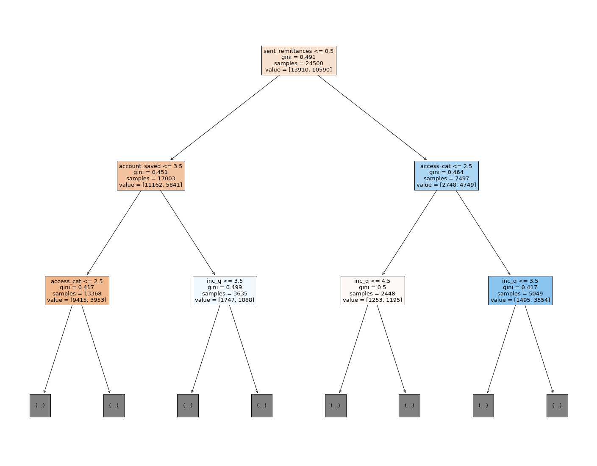
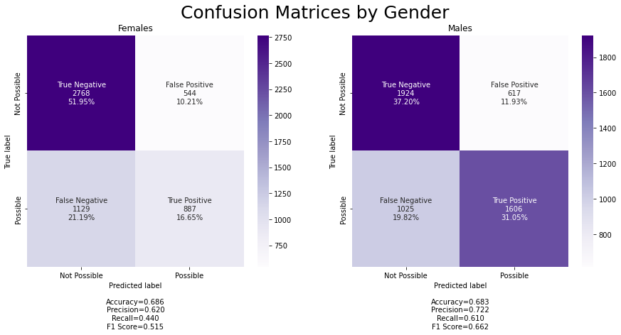
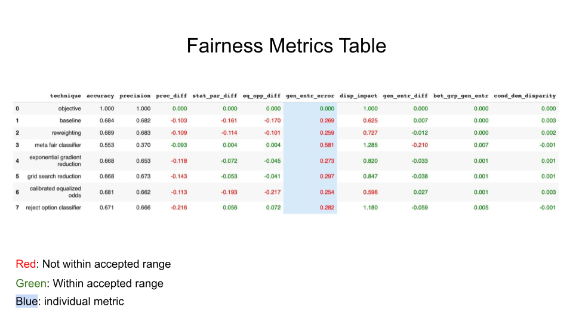

```{python, include=FALSE}
# !pip install seaborn
# !pip install numpy
# !pip install pandas
# !pip install matplotlib
```

```{python, include=FALSE}
# test python chunk

# Imports
import pandas as pd
import numpy as np
import seaborn as sns
# from plotnine import *
import matplotlib.pyplot as plt
# from sklearn.model_selection import train_test_split
# from sklearn.tree import DecisionTreeRegressor
# import statsmodels.api as sm
# from sklearn.compose import make_column_transformer
# from sklearn.preprocessing import OneHotEncoder
# from sklearn.linear_model import LogisticRegression, LogisticRegressionCV
```

# Introduction


Science is often viewed as a way to offer trustworthy research backed solutions and answers. A lot of that research involves statistical methods performed on data however, what happens when the data and statistical methods are not as objective and trustworthy as is so often assumed? The conclusions drawn from the data are biased and unfair, most often towards minorities and protected classes of people. To contribute to a human rights based approach to data analysis, we evaluate fairness metrics on a machine learning algorithm to measure bias. We use a Global Findex data set which contains financial information about 35 Sub Saharan countries. Specifically, we create models to predict access to emergency funds, then analyze the fairness of those models. We focus on group and individual fairness metrics for the protected attribute sex. In addition we investigate the data set itself to understand where potential biases might have been implanted. 

Data sets and algorithms have real world impacts on real people. The inherent bias in data sets can carry over into machine learning algorithms that are used to profile and categorize people [@navarro2021risk;@hellstrom2020bias]. Since data set's are not collected in a vacuum and often represent the discriminatory environments in which they are collected [@barocas_fairness_nodate], we must find ways to make data sets and statistical methods more equitable. In this study we explore fairness methods that can be used to evaluate machine learning models. The “impossibility theorem” is the idea that not all fairness metrics can be satisfied at the same time[@kleinberg2016inherent]. Although fairness is complex and there are multiple approaches to make a model fair [@kypraiou_what_2021;@green2018myth], it's important to continue to question how data and algorithms can be biased and how to mitigate that bias. 

While there have been previous studies implementing fairness techniques in different contexts[@deho2022existing; @kim2022information], we implement them in an exploratory context meant to teach how and when to use these techniques thus giving us more freedom to branch beyond a specific question while supporting previous work about the importance of these fairness metrics[@anahideh2022fair;@barocas_fairness_nodate]. We analyse the data, data collection methods, prediction models, and the fairness metrics to assess how biased our data is and understand how we can de-bias when possible.   

# Data

Our data is derived from The World Bank in The Global Findex Database, comprising the most comprehensive data sets on how adults save, borrow, make payments, and manage risk in more than 140 economies around the world. The data set was created to record various measures of financial equity and inclusion, with the intention that such information could reveal opportunities to expand access to financial services and to promote greater use of digital financial services for individuals who do not have a bank account. Conducted by Gallup, Inc for the annual Gallup World Poll, the participants responded to the questionnaire either on the phone or in-person. There were several variables of interest in this dataset when creating models to predict access to emergency funds, including demographic and financial information. For this analysis, we are using only a subset of the data including countries in the Sub-Saharan region (35 countries total). Our data set includes 35000 observations and 105 variables in total.

```{python, include=FALSE}
# Read in Data
file = 'https://raw.githubusercontent.com/sds-capstone/2022-09-proj7-women-at-table/main/findex_SubSahAfrica.csv'
df = pd.read_csv(file, index_col=0)
print(f'There are {df.shape[0]} entries and {df.shape[1]} features')
df.head()
```

```{python, echo=FALSE}
# Set Gender Palette
red = '#FF7377'
blue = '#00B2EE'
gender_palette = [blue, red]

purple = '#BF3EFF'
green = '#1B851B'
yes_no_pal = [purple, green]

pink = '#FFC0CB'
```

```{python, include = FALSE}
# select vars of interest
df2 = df[['female', 'age', 'emp_in', 'account_fin', 'fin24', 'fin25', 'fin32', 'fin48', 'educ', 'economy']]
# Recode fin24 values
df2.loc[df2['fin24'] == 1, "fin24"] = 'Yes'
df2.loc[df2['fin24'] == 2, "fin24"] = 'No'
df2.loc[df2['fin24'] == 3, "fin24"] = 'Don\'t Know'
df2.loc[df2['fin24'] == 4, "fin24"] = 'Refuse'
# rename fin24 to has_access
df2.rename(columns = {'fin24': 'has_access'}, inplace = True)
# recode gender
df2.loc[df2['female'] == 1, "female"] = 'male'
df2.loc[df2['female'] == 2, "female"] = 'female'
df2.rename(columns = {'female': 'gender'}, inplace = True)
# recode account_fin
df2.loc[df2['account_fin'] == 0, "account_fin"] = 'No'
df2.loc[df2['account_fin'] == 1, "account_fin"] = 'Yes'
# recode emp_in
df2.loc[df2['emp_in'] == 0, "emp_in"] = 'No'
df2.loc[df2['emp_in'] == 1, "emp_in"] = 'Yes'
# Recode fin32 values: Recieved Wage Payments
df2.loc[df2['fin32'] == 1, "fin32"] = 'Yes'
df2.loc[df2['fin32'] == 2, "fin32"] = 'No'
df2.loc[df2['fin32'] == 3, "fin32"] = 'Don\'t Know'
df2.loc[df2['fin32'] == 4, "fin32"] = 'Refuse'
# recode fin48 values: National ID
df2.loc[df2['fin48'] == 1, "fin48"] = 'Yes'
df2.loc[df2['fin48'] == 2, "fin48"] = 'No'
df2.loc[df2['fin48'] == 3, "fin48"] = 'Don\'t Know'
df2.loc[df2['fin48'] == 4, "fin48"] = 'Refuse'
#recode educ values: Highest Level of Education
df2.loc[df2['educ'] == 1, "educ"] = 'Primary'
df2.loc[df2['educ'] == 2, "educ"] = 'Secondary'
df2.loc[df2['educ'] == 3, "educ"] = 'Tertiary'
df2.loc[df2['educ'] == 4, "educ"] = 'Don\'t Know'
df2.loc[df2['educ'] == 5, "educ"] = 'Refuse'
#recode fin25 values: Main Source of Emergency Funds
df2.loc[df2['fin25'] == 1, "fin25"] = 'Savings'
df2.loc[df2['fin25'] == 2, "fin25"] = 'Family, relatives, or friends'
df2.loc[df2['fin25'] == 3, "fin25"] = 'Money from working'
df2.loc[df2['fin25'] == 4, "fin25"] = 'Borrowing from a bank/employer/private lender'
df2.loc[df2['fin25'] == 5, "fin25"] = 'Selling assets'
df2.loc[df2['fin25'] == 6, "fin25"] = '(Some other source)'
df2.loc[df2['fin25'] == 7, "fin25"] = 'Don\'t Know'
df2.loc[df2['fin25'] == 8, "fin25"] = 'Refuse'
#recode fin32 values: Recieved Wage Payments
df2.loc[df2['fin32'] == 1, "fin32"] = 'Yes'
df2.loc[df2['fin32'] == 2, "fin32"] = 'No'
df2.loc[df2['fin32'] == 3, "fin32"] = 'Don\'t Know'
df2.loc[df2['fin32'] == 4, "fin32"] = 'Refuse'

df2.rename(columns = {'fin32': 'Receive Wage Payments', 'fin48': 'National ID', 'educ': 'Education', 'fin25': 'main_source_funds'}, inplace = True)
df2.head()
```

## Demographics

### *gender*

The variable *gender* distinguishes gender. There are 16,716 males in this dataset and 17,388 females. This is a fairly equal distribution that we can see in the graph below.

```{python, echo=FALSE, fig.width=3, fig.height=2}
# barplot female versus not
g = sns.countplot(x = 'gender', data = df2, palette = gender_palette)
for p in g.patches:
   g.annotate('{:.1f}'.format(p.get_height()), (p.get_x()+ .3, p.get_height()+100))
g.set(title = "Gender Distribution")
```

### *Education*

The *Education* variable corresponds to the highest level of education attained with 'Primary', 'Secondary' and 'Tertiary' being the three options. Here is the distribution of education by gender:

```{python, echo=FALSE}
ebg = sns.countplot(x="Education", hue= "gender", palette= gender_palette, order= ['Primary', 'Secondary', 'Tertiary'], data= df2)
for p in ebg.patches:
   ebg.annotate('{:.1f}'.format(p.get_height()), (p.get_x()+.05, p.get_height()+100))
ebg.set(title= "Education Count by Gender")
```

The bar plot above shows us that there are more women with primary education, but more men with secondary or tertiary education. Overall, we can see that there are more men with higher education than women. About 1,000 more men have received a secondary education and there is about double the amount of men with tertiary education compared to women showing a clear disparity.

### *economy*

The final demographic variable of interest is the *economy* variable that separates respondents by which country they live in. There are 35 different countries from Sub-Saharan Africa with exactly 1000 respondents from each.

```{python}
df2['economy'].unique()
```

## Financial

From the financial related variables, we were most interested in a few specific financial variables that we thought would have an impact on access to emergency funds.

### *account_fin*

The first variable being *account_fin* which distinguishes those who have a financial account from those who don’t:

```{python, echo=FALSE}
# barplot of number of people who have a bank account
g = sns.countplot(x = 'account_fin', data = df2, palette = yes_no_pal)
for p in g.patches:
   g.annotate('{:.1f}'.format(p.get_height()), (p.get_x()+ .3, p.get_height()+100))
g.set(title = "Distribution of Has a Financial Account", xlabel = 'Has a financial account?')
```

We can see that about two thirds of individuals do not have an account. This is likely connected to the lack of access to emergency funds displayed above given that if an individual does not have a financial account, we would expect they are less likely to have a source of emergency funds, as emergency funds are generally stored in an account.
 
### *reason*

Those who do not have a financial account were asked why in the *reason* variable, that provides a list of possible reasons for not having a financial account:

```{python, include=FALSE}
# reasons for no financial account
# pivot data to long format
df_long = df[['fin11a', "fin11b", "fin11c", "fin11d", "fin11e", "fin11f", "fin11g", "fin11h"]]\
.stack()\
.reset_index()
df_long.rename(columns = {'level_1':'reason', 0:'value'}, inplace = True)
df3 = df_long.query('value == 1.0') # filter to only "yes" answers for each reason
# recode reason values
df3.loc[df3['reason'] == 'fin11a', "reason"] = 'distance'
df3.loc[df3['reason'] == 'fin11b', "reason"] = 'expense'
df3.loc[df3['reason'] == 'fin11c', "reason"] = 'no_documentation'
df3.loc[df3['reason'] == 'fin11d', "reason"] = 'lack_trust'
df3.loc[df3['reason'] == 'fin11e', "reason"] = 'religious'
df3.loc[df3['reason'] == 'fin11f', "reason"] = 'lack_money'
df3.loc[df3['reason'] == 'fin11g', "reason"] = 'family_member_has'
df3.loc[df3['reason'] == 'fin11h', "reason"] = 'no_need'
df3.head()

# aggregate counts by reason
reason_counts = df3.groupby('reason').agg('count').reset_index()
```


```{python, echo=FALSE}
# barplot of count by reason-- seaborn
reasons_plot = sns.barplot(y = 'reason', x = 'value', data = reason_counts, palette = [pink, pink, pink, pink, pink, pink, pink, pink], order = ["lack_money","expense",  "no_documentation", "distance", "lack_trust", "no_need", "family_member_has", "religious"]).set(title = "Reasons for No Financial Account", xlabel = "count")
reasons_plot
```

### *emp_in*

Employment status was another financial variable of interest represented by *emp_in*, which asks whether or not the participant is in the workforce. It appears that about three-fourths of individuals are in the workforce:

```{python, echo=FALSE}
# Distribution by in workforce
g = sns.countplot(x = 'emp_in', data = df2, palette = yes_no_pal)
for p in g.patches:
   g.annotate('{:.1f}'.format(p.get_height()), (p.get_x()+ .3, p.get_height()+100))
g.set(title = "Distribution of Whether or not in Workforce", xlabel = "In workforce?")
```

### *inc_q*

And lastly, we evaluated *inc_q*, which represents income quantile. Income quantile is separated into 5 quantiles with 1 being the poorest and 5 being the richest. The mean for all of the countries in the dataset is 3.241. This means that all the countries average out to be about middle class.

```{python, echo=FALSE}
df_inq = df['inc_q']
df["inc_q"].mean()
# fig = plt.figure()
# ax1 = fig.add_subplot(2,2,1) 
# sns.countplot(df_inq, ax = ax1)
# ax1.set_xlabel("Income Quantile")
# ax1.set_xticklabels(['Poorest 20%','Second 20%','Middle 20%','Fourth 20%','Richest 20%'])
# ax1.title.set_text('Income Quantile  Distribution')
```

The majority of the data set has individuals within the richest quantile, Quantile 5.

## Emergency Funds

To explore access to emergency funds in our dataset, we were interested 3 variables we thought could be related:

### *has_access*

The variable *has_access* directly asks participants if they have access to emergency funds, with “emergency funds” defined as 1/20th of the GNI (gross national income) per capita for the country. GNI per capita is the country’s total income in a year/ the country’s population size. For context, in the United States, “emergency funds” would be defined as about $3,000. 

```{python, echo=FALSE}
# barplot of access to emergency funds
g = sns.countplot(x = 'has_access', data = df2, palette = yes_no_pal, order = ['No', 'Yes'])
for p in g.patches:
   g.annotate('{:.1f}'.format(p.get_height()), (p.get_x()+ .25, p.get_height()+100))
g.set(title = "Distribution of Access to Emergency Funds")
```

The barchart above displays the overall distribution of access to emergency funds. We can see that over half of individuals represented in the data do not have access. 

### *main_source_funds*

We proceeded to explore the source of emergency funds using the *main_source_funds* variable, which provides a list of options for where participants receive their main source of emergency funds:

```{python, echo=FALSE}
# barplot of main source of emergency funds
chart = sns.countplot(y = 'main_source_funds', 
                      data = df2, 
                      order = ["Money from working","Family, relatives, or friends",
                               "Savings", "Selling assets",
                               "Borrowing from a bank/employer/private lender", "(Some other source)"]).set(
                      title = "Distribution of the Main Source of Emergency Funds")
                      
chart
```

The barchart above displays the overall distribution of the main source of emergency funds. Most of the individuals with access to emergency funds receive their funding from work, their family and friends, or their savings.

### *Recieve Wage Payments*

Diving further into the "Money from Working" category, we can see that only 8196 individuals receive wage payments from the *Receive Wage Payments* variable. This analysis suggests that receiving wage payments may be a key factor in determining access to emergency funds.

```{python, echo=FALSE}
# barplot of recieved wage payments
chart = sns.countplot(x = 'Receive Wage Payments',data = df2, order = ["No", "Yes"], palette = yes_no_pal)
for p in chart.patches:
   chart.annotate('{:.1f}'.format(p.get_height()), (p.get_x()+ .25, p.get_height()+100))
chart.set(title = "Distribution of Received Wage Payments")
```

### *gender*, *economy* and *Education* in relation to Emergency Funds

Finally, we sought to find if there were disparities in access to emergency funds by *gender*, *economy*, and *Education*.

```{python, include = FALSE}
df_gender = df2[['gender', 'economy']].query("gender == 'female'").groupby('economy').count()
df_gender = df_gender.assign(male = lambda df_gender: 1000 - df_gender['gender']).rename(columns = {'gender': 'female'})
 
#Percent of females
df_gender = df_gender.assign(Female = lambda df_gender: (df_gender['female'])/10)
 
#Percent of males
df_gender = df_gender.assign(Male = lambda df_gender: 100 - df_gender['Female'])
 
df_gender = df_gender[['Male', 'Female']]
df_gender['economy'] = df2.economy.unique()
df_gender = df_gender.sort_values('Male')
 
# Counting by Access to Emergency Funds by gender
f_access = df2[['has_access', 'economy', 'gender']].query("has_access == 'Yes' & gender == 'female'").groupby('economy').count()
m_access = df2[['has_access', 'economy', 'gender']].query("has_access == 'Yes'& gender != 'female'").groupby('economy').count()

# Defining acccess vs no access by country columms
f_count = f_access['has_access']
m_count = m_access['has_access']
 
# Merging columns
df3 = pd.merge(f_count, m_count, how='inner', on = 'economy')
df3 = df3.assign(total = lambda df3: df3['has_access_x']+df3['has_access_y'])
 
#Percent of females with access
df3 = df3.assign(f_percent_access = lambda df3: (df3['has_access_x']/df3["total"])*100)
 
#Percent of males with access
df3 = df3.assign(m_percent_access = 100 - df3['f_percent_access'])
 
df3['economy'] = df2.economy.unique()
df3 = df3[['m_percent_access', 'f_percent_access',   'economy']]
df3 = df3.sort_values('m_percent_access')
df3 = df3.rename(columns = {'m_percent_access':'Males With Acesss', 'f_percent_access': 'Females With Access'})
```

```{python,echo=FALSE}
# not displaying properly
# create new figure
#fig = plt.figure()
#add sub plot
#ax1 = fig.add_subplot(1,2,1)
# fig 1
df_gender.set_index('economy').plot(kind='barh', stacked=True, color=['steelblue', 'pink'], title = "Percent of Participants by Country & Gender").axvline(x = 50, color = "red", linestyle = "dashed")
#add sub plot
#ax2 = fig.add_subplot(1,2,2)
# fig 2

# set fig size
#fig.set_size_inches(7, 5)

```

```{python,echo=FALSE}
df3.set_index('economy').plot(kind='barh', stacked=True, color=['steelblue', 'pink'], title = "Percent of Participants with Access to Emergency Funds by Country & Gender").axvline(x = 50, color = "red", linestyle = "dashed")
```

In the side-by-side barplots above, we can see that although only about 50% of the countries have a higher percentage of men represented in the questionnaire (left bar plot), in 75% of the countries more men have access to emergency funds than women (right bar plot).

```{python, echo=FALSE}
# Counting by Access to Emergency Funds by country
access = df2[['has_access', 'economy']].query("has_access == 'Yes'").groupby('economy').count()
no_access = df2[['has_access', 'economy']].query("has_access == 'No'").groupby('economy').count()
 
# Defining acccess vs no access by country columms
a_count = access['has_access']
no_a_count = no_access['has_access']
 
# Merging columns
df3 = pd.merge(a_count, no_a_count, how='inner', on = 'economy')#.assign(total = lambda df3: df3['has_access_x']+df3['has_access_y'])
#df3 = df3.assign(percent_access = lambda df3: (df3['has_access_x']/df3["total"])*100)
 
df3['economy'] = df2.economy.unique()
df3 = df3.sort_values('has_access_x')


educ_perc = (df2.groupby(['Education'])['has_access']
                     .value_counts(normalize=True)
                     .rename('percentage')
                     .mul(100)
                     .reset_index()
                     )

```

```{python, echo=FALSE}
# not showing up and idk why
educ_access = sns.barplot(x = "Education", y = "percentage", order= ['Primary', 'Secondary', 'Tertiary'], hue="has_access", palette= yes_no_pal, hue_order= ['No', 'Yes'], data = educ_perc)
for p in educ_access.patches:
  educ_access.annotate('{:.1f}'.format(p.get_height()), (p.get_x()+.12, p.get_height()+.5))
educ_access.set(title = "Access to Emergency Funds by Education Level", xlabel = 'Education Level')
educ_access.axhline(y = 44, color = "red", linestyle = "dashed")
```

Additionally, in the barplot above we can see the distribution of funds based on an individual’s highest education level. 63% of people with only a primary education do not have access to emergency funds compared to 37% of people who do. These numbers are more evenly distributed for those with secondary education, with about 49% of people not having access to emergency funds, while 51% of people do have access. Finally, for those with a tertiary level of education we can see that about 72% of people have access to emergency funds while only 28% of that group does not have access. Overall, we can make the assumption that people with a higher level of education are more likely to have access to emergency funds.

# Methods

## Software

We conducted our analysis in a Google Colab Notebook primarily employing the python libraries [pandas](https://pandas.pydata.org/) and [numpy](https://numpy.org/) for data cleaning and exploratory analysis, as well as [sklearn](https://scikit-learn.org/stable/) and [aif360](https://aif360.readthedocs.io/en/latest/) for implementing machine learning methods, fairness metrics, and de-biasing techniques. The notebook detailing our [full analysis](https://github.com/sds-capstone/2022-09-proj7-women-at-table/blob/main/final_project.ipynb) is available via our public [GitHub repository](https://github.com/sds-capstone/2022-09-proj7-women-at-table).

## Data Cleaning

Before fitting the model, we performed several pre-processing steps on the data in order to remove unnecessary or redundant information, address missing values, and ensure that the variables were coded such that they would be processed appropriately by the model. Some of these steps were performed after fitting the initial model, and some choices were made based on the impacts of those choices on the performance of the model. 

First, we removed the arbitrary variables *economycode* (country code) and *regionwb* (region); *economycode* is essentially a duplicate of *economy* (country name), and *regionwb* is the same for all rows (value is Sub-Saharan) since this is the variable that we initially filtered by. Next, we checked for variables with a high percentage of missing values. Several variables have many missing values because they are follow-up questions to a previous question that are only asked if the respondent gives a specific response for a previous question. We chose to drop all variables with more than 30% missing values (58 variables total) because we observed by running the model multiple times that variables with NA percentages above this threshold had no impact on the model accuracy or fairness. Thus, it made sense to remove them if their presence is negligible when included in the model. Next, we checked for variables with high levels of redundancy (i.e. little variation), defining a high level of redundancy as 95% or more of the values being the same. The only variable with a high level of redundancy was *pay_online* (a binary variable indicating whether or not an individual has paid online for something), and we chose to remove it because removing it had no impact on the model accuracy and fairness.

Many of the questions in the survey were structured such that the potential responses were "yes", "no", "don't know", and "refuse". Based on our exploratory data analysis, it seems that for most questions, the numbers of "don't know" and "refuse" responses are very low. Furthermore, these responses would not give us much useful information when implementing a predictive model. Thus, we chose to replace all "don't know" and "refuse" values with *NA* values. We then replaced all remaining missing values (including missing values not removed previously and "don't know" and "refuse" values) with the column mean rounded to the nearest whole number (i.e. the most frequent value if the variable is categorical).

Next, we re-coded the country variable into a variable with five categories based on the percentage of sampled individuals in the country who have access to emergency funds (1 = < 20% have access, 2 = between 20% and 40% have access, etc.). All other variables in our data set were coded such that the model could appropriately interpret them, so we did not have to do any additional re-coding. The majority of the variables are binary with 0 = no, 1 = yes, and the rest are either categorical variables with hierarchical categories such as income quantile and education level or continuous numerical variables such as age.

Finally, we created a cartesian product to combine two variables -- one indicating whether or not an individual has a financial account and the other indicating whether or not the individual has saved money in the past 12 months-- in order to increase the accuracy of the model after fitting the initial model.

After this pre-processing, we have 42 predictor variables and 35,000 observations.

## Model Selection

Given that we are aiming to predict a binary outcome (possible or not possible to come up with emergency funds), our model needs to be a classification model. We tried two of the most common model types used for classification-- logistic regression and decision tree classifier. We ultimately chose the decision tree classifier model over the logistic regression model because the baseline accuracy was higher (61% versus 55%). Furthermore, the decision tree model makes more intuitive sense given our data since most of our predictors are binary variables, and binary predictors fit well into the tree structure. We were able to further improve the accuracy of the decision tree model to 68% by using cross-validation to specify the max depth as 6. The decision tree model uses machine learning to predict outcomes by organizing the variables into a tree that branches off at each decision point based on the value of the variable at that point. The most influential variables are at the top, and the outcome variable is at the end of each branch. We split our data into 70% training, 30% testing because this is the standard train-test split used for machine learning algorithms.

## Metrics
Fairness metrics are a way to assess machine learning algorithms for unwanted bias. Algorithms can classify people unfairly using data collected in a biased environment. When classifying people, it's important to understand how these classifications can contribute to and reinforce discriminatory social systems. Accuracy shouldn't always be prioritized. It is useful to sacrifice accuracy in favor of fairness when using machine learning algorithms to make decisions impacting people.To assess fairness and accuracy in our model we explore 12 different metrics, 10 of which are fairness metrics. Fairness metrics can be split into group and individual metrics.

Group fairness metrics ensure parity between privileged and unprivileged groups of a protected class. For example, for the protected class sex, the privileged group is men and the unprivileged group is women. The model should work similarly for both of these groups and not favor the privileged group. Group fairness metrics measures how discriminatory the model classifies the unprivileged group[@binns2020apparent; @mehrabi2021survey; @caton2020fairness]. The group metrics we explore include statistical parity difference, equal opportunity difference, disparate impact,precision score difference, general entropy difference,and conditional demographic parity.Not all group fairness metrics can be satisfied at the same time. For example equal opportunity difference and statistical parity difference cannot be simultaneously accounted for[@kypraiou_what_2021].

Individual fairness metrics measure how similarly the model predicts for similar observations. Will two very similar people receive the same classification? Individual fairness metrics contradict group fairness metrics. When accounting for imbalanced predictions between groups, the within group fairness can suffer[@kypraiou_what_2021]. In the process of satisfying group metrics, two similar subjects only differing by sex, may be classified differently [@binns2020apparent; @mehrabi2021survey; @caton2020fairness; @zhou2022bias]. The individual metrics we explore are general entropy error and consistency score. We can measure both individual and group fairness with the between group general entropy error metric. 

One approach to fairness in machine learning is "fairness by unawareness" meaning a model is blind to the sensitive attributs. Although it may seem an intuitive approach to simply remove the protected attribute from the data in order to make the algorithm unbiased, this is often not an effective approach to reduce bias.
There are often variables that remain in the data that act as pseudo substitutes for the protected attribute [@zhou2022bias]. For example, if race was excluded from the model but the variable zip code remained. Zip code can act as a stand in for race in regions where people are segregated by race. 

In our case we are focusing on the protected attribute gender. The other variables in this data set are education, age, and all the financial variables. If any of these variables are segregated by gender, by inherit gender bias in society, then simply removing the gender variable will not solve anything.


### Accuracy.
Accuracy is a measure of how many classifications our model predicts correctly compared to all the predictions. The ratio of correctly predicted classifications to all the predictions. Accuracy cannot tell us if the predictions are equally correct across positives and negatives [@juba2019precision; @gupta2021recall]. 55% of the people in our data set don't have access to emergency funds. As long as our model predicts negatives more than half the time, we can get a good accuracy. However, our model will lose the ability to accurately predict positives. It is important to consider accuracy along with precision and recall so we can more fully understand how our model is classifying people.

$Accuracy = (True Positives + True Negatives) / (True Positives + True Negatives + False Positives + False Negatives)$


### Precision.
Precision is a measure of how accurately a model predicts positive outcomes.The ratio of correctly predicted positives to all predicted positives. With high precision rates, we have low false positive rates [@juba2019precision; @gupta2021recall]. 

$Precision = true positives / (true positives + false positives)$

### Recall.
Recall is a measure of how accurately a model predicts negative outcomes.The ratio of correctly predicted negatives to all predicted negatives[@gupta2021recall]

$Recall = true negatives / all negatives)$
 

### Statistical Parity Difference.
This metric computes the difference in percentages between the "privileged" and "non-privileged" group of individuals who were predicted to have the desired outcome. In this case, it is essentially 

(% of females who were predicted to have access to emergency funds) - (% of males who were predicted to have access to emergency funds)

The "ideal" value is 0 because if we define fairness as statistical parity, the goal would be for the percentages to be equal for both groups. If the value is negative, that means that the percentage of individuals with the positive outcome is higher for the privileged group (males), implying that the model is biased in favor of the privileged group. Conversely, if the value is positive, the model is biased in favor of the unprivileged group. The acceptable range in which the model is considered fair is between -0.1 to 0.1 (with percentages expressed as decimals, e.g. 0.1 = 10%). It is important to note that this metric is solely focused on making the percentage of *predicted* favorable outcomes equal across groups and does not take into account the accuracy of the predictions at all.[@caton2020fairness;@kypraiou_what_2021]

Relating to our data, this metric will tell us if our model predicts that men have more access to emergency funds than women. In our data, men in fact do have more access to emergency funds than women. 51% of men have access to emergency funds while only 38.2% of women have access to emergency funds. When using this metric to asses our model the interpretation depends on the context. If this model is being used to decide how to allocate emergency funds, we might not want to prioritize satisfying this metric. We are using this model in an educational and exploratory manner, so we will use techniques to account for this metric. 


### Equal Opportunity Difference.
This metric is similar to statistical parity in that it is also a group fairness metric, but it is different in that it takes into account accuracy of the model in addition to equalizing outcomes across groups. Instead of measuring the simple differences in percentages between groups of individuals with the (predicted)positive outcome, it measures the difference in percentages of *accurately identified* individuals with positive outcomes (i.e. true positives). Essentially, the calculation is the same as for statistical parity, but only taking into account true positives for each group. Again, the "ideal" value is 0 with negative values indicating bias in favor of the privileged group, and the fairness range is -0.1 to -0.1 [@caton2020fairness].

This metric helps us answer if our model predicts positives with more accuracy for men than women. Are men more accurately predicted to have access to emergency funds than women? 


### Disparate Impact.
The disparate impact metric measures the proportion of positive outcomes between an unprivileged group and a privileged group. It is usually assessed when predicting an outcome that disproportionately affects a sub population. For example, hiring more men than women as construction workers on the basis of height and strength.For this case we want to know the proportion of females that are categorized as having access to emergency funds VS males who are categorized as having access to emergency funds.The standard for satisfying this metric is that the unprivileged group must receive a positive outcome at a ratio of 4:5 to the privileged group. As long as females are classified as having access to emergency funds no less than around 80% of the time males are categorized as having access to emergency funds, then our model satisfies this metric.[@caton2020fairness] This metric is similar to statistical parity except it measures a ratio which can be useful for legal purposes. 
$P(\hat{Y}=unprivilegedPositivePredicted) /P(\hat{Y}=privilegedPositivePredicted)$

A similar problem arises when assessing this metric as statistical parity.In reality women have less access to emergency funds than men. If we manipulate our model to satisfy this metric, we will falsely predict that women have access to emergency funds when they don't. This could be more harmful than not satisfying this metric.


### Conditional Demographic Disparity.

Statistical parity difference and equal opportunity difference both measure positive outcomes. The conditional demographic disparity measures negative outcomes. Demographic Disparity is a metric that examines how disadvantaged groups compare to advantaged groups for negative outcomes from the model.This metric checks if a subpopulation is classified with a negative outcome more than a positive outcome. Are females classified as not having access to emergency funds more often than men? Looking at the entire data set, women have less access than men to emergency funds. Predicting more negative outcomes for women than men is not necessarily a bad thing. We want to know if someone doesn't have access to emergency funds so that they can potentially be helped. 

Sometimes when we split data into categories we can find patterns that don't exist when the data is combined. This is called Simpsons paradox [@mehrabi2021survey]. We can see this in our confusion matrices. When our data is split by gender there are different prediction rates than the entire model. The true negative rates are heavily weighted by females, and the true positive rates are weighted towards males. Is this the Simpsons paradox or does gender split the data into different distributions? The Conditional Demographic Disparity metric accounts for the Simpsons paradox to confirm true differences or no differences in negative outcomes in the model.

The range of scores for this metric is from -1 to 1. In general a positive value means that the model is more unfair towards the unprivileged group. A value of zero is ideal. In our case, if our model were to predict an equal proportion of negative and positive outcomes for men and women, our model would realistically be unfair to women. Women do have less access to emergency funds and predicting that men and women equally don't have access to emergency funds might put women at a greater disadvantage if a relief program were to be put in place. However, if assessing financial stability between men and women we would be more concerned with satisfying this metric. 


### General Entropy Error.
This metric is an individual metric rather than a group metric, and it computes fairness by computing the level of unfair benefit being assigned by the model. The metric defines "benefit" as follows: for any individual in the testing data set, that individual has received a benefit if the model predicted the favorable outcome when the truth was that the individual did not have the favorable outcome (i.e. a false positive). Each individual in the data receives either a 2 (benefit, false positive), a 1 (no benefit, correct prediction), or 0 (no benefit, false negative). The metric then compares the benefit of each individual to the average accuracy and false positive level of the model. The "ideal" value is 0, and a higher number indicates a higher level of inequity in benefit among individuals. In other words, if many individuals have a benefit score that is far off from the average, that indicates that the model is unfairly benefiting some individuals and not others. This metric does not consider privileged versus unprivileged groups, and thus is not able to indicate whether or not the inequality in benefit is systematic in any particular way (i.e., it cannot tell whether males receive more benefit than females; it can only tell that some individuals receive higher benefits than others)[@caton2020fairness;@kypraiou_what_2021].

This metric is important to our data because a false positive outcome(higher benefit) would mean that someone is predicted to having access to emergency funds when they don't. If there is a high general entropy error, there are many individuals who's need for emergency funds are being overlooked.

### General Entropy Error Difference.
The general entropy error cannot tell whether males receive more benefit than females so we calculate the general entropy error difference between males and females. Do men "benefit" from our model more i.e does our model predict more accurate and false positives for men than women? Again the interpretation of this metric will depend on the context. A higher score is given for false positives, but this means a group of people are being predicted to have emergency funds when they don't. It is not necessarily a good thing for any group to "benefit" from our model. A value of 0 represents no difference.


### Between Group Generalized Entropy Error.
We explored generalized entropy error and how it differs for males and females. Using the between group generalized error metric we will be able to see if the between group unfairness or the individual unfairness dominates. Is there truly a difference in generalized entropy error between men and women or is the general entropy error not due to gender inequality. Is our model unfairly benefiting individuals based on sub populations or is the inequity equal between groups and differs at the individual level?

We don't want generalized entropy error in our model, but it would be better to have it at the individual level than the group level. We don't want either men or women to have more generalized entropy error than the other. If the error is equally within the groups, then both men and women are at a similar "benefit" to each other. 

### Consistency Score.
Are similar people treated similarly. Is our model consistent in the way it classifies people as having access to emergency funds? This metric alone wont tell us if our model is fair but we can see how different groups of people are generally treated. We split the consistency score by gender and we can see if our model is more consistent for men or women. Are individuals within each group being treated similarly? With the other metrics in mind we can determine if they are being treated similarly unfairly or similarly fair. This metric is calculated on a scale from 0 to 1 where a value of 1 means completely consistent. 

## In and Post Processors
To account for any unfairness we find in the model we can use in and post processing techniques.These techniques restructure the data and reclassify observations in order to satisfy these metrics.

### Reweighing.
Reweighing is a pre-processing technique which assigns weights such that the protected attribute (gender) becomes statistically independent from the outcome variable (access to emergency funds). This means that after reweighting, knowing the gender of an individual does not provide any information about whether or not the individual has access. In mathematical terms, P(gender = male and access = yes) = P(gender = male)*P(access = yes), and this equality holds true for all gender-access combinations.


### Exponentiated Gradient Reduction.

The exponentiation gradient reduction is an in-processing optimization approach. This processor aims to optimize both accuracy and fairness focusing on demographic parity and equalized odds. The algorithm this processor uses considers randomized classifiers and cost restraints to find the optimal classifier that satisfies fairness restraints without losing too much accuracy [@agarwal2018reductions]. 


### Grid search Reduction.

Grid search reduction uses the cost restraint lamda to find a balance between fairness and accuracy. This processor searches over a grid of lamda values until the best value is found. This value is used in the classifier to satisfy fairness and maximize accuracy. The grid search reduction is useful for binary sensitive attributes and fairness metrics with minimal constraints like demographic parity and equalized odds [@agarwal2018reductions; @agarwal2019fair]


### Calibrated Equalized Odds.

Calibrated equalized odds uses a post-processing technique that re classifies values to satisfy the equalized odds metric while keeping the classifier calibrated. A classifier is calibrated if the proportions of positive and negative outcomes in the data match the probabilities produced by the model. We want the calibration to hold across groups such as male and female. This processor aims to satisfy an equalized cost constraint while maintaining calibration [@pleiss2017fairness].


### Reject Option Classifier.

The reject option classifier is a post-processor that aims to reduce discriminatory classifications based on the sensitive attribute. In our case we aim to find a balance for predictions between males and females. This classifier will relabel observations in a way that reduces discrimination. More males will be relabeled with the unfavorable outcome and more females will be relabeled with the favorable outcome [@kamiran2012decision].


### Meta Fair Classifier.
The meta fair classifier creates a new estimator but includes a reweighing pre-processing step [@celis2019classification]. This classifier should be used as part of a pipeline of steps. We must create a binary label data set. This means that the data includes either a 1 representing access to emergency funds or 0 for no access to emergency funds. This classifier aims to transform the data in a way that will satisfy as many fairness metrics as possible [@agarwal2018reductions].

## Results 

### Decision Tree Model (Figure2)

{width=50%, height=50%}

The decision tree model organizes the variables into a tree branching off at each decision point based on the value of the variables at that point. The most influential variables are at the top, and the outcome variable is at the end of each branch. In our decision tree, the most influential variable was sent_remittances. Sent_remittances is a binary variable that asks participants, “In the PAST 12 MONTHS, have you, personally, GIVEN or SENT money to a relative or friend living in a different city or area INSIDE (country where survey takes place)? This can be money you brought yourself or sent in some other way.” It makes sense that this is the most influential variable in relation to access to emergency funds, because if you have the privilege to send spare money to loved ones, you most likely have extra money saved for yourself as well.

Depending on the response to sent_remittances the tree branches into two, considering participants’ responses to the next two influential variables: access_cat and account_saved. Access_cat is a variable that categorizes the 35 sub-saharan countries by the percent of access to emergency funds according to its participants ranging between 1-5, with 1 being 0%-20% of participants in that country having access to emergency funds, and 5 being 80%-100% of participants having access to emergency funds. Depending on the country the participant lives in, they’ll be assigned to a number between 1-5 for access_cat. On the other hand, account_saved is a variable that categorizes participants based on their personal finances ranging from 1-4, with 1 representing having no financial account and no money saved, and 4 representing having a financial account and money saved. Being assigned 2 or 3 in account_saved, means you either only have a financial account, or only have money saved, but not both.

The decision tree then splits according to participants’ responses all the way down the tree, until finally it can predict whether or not based on the responses the participant has access to emergency funds.

### Confusion Matrices by Gender (Figure3)

{width=50%, height=50%}

When we create two separate confusion matrices separated by gender, we can see that the model is fairly good at predicting true negatives for both groups, but is significantly better at predicting true positives for males as compared to females. The false positive and false negative error rates are also slightly higher for females as compared to males, yet the rates are pretty similar for both models.

This may be an example of the model reinforcing biases that are present in the data because we saw from our exploratory data analysis that many fewer females than males have access to emergency funds, so if there are not many females that have true positive values recorded in the data, the model is likely to be less accurate in predicting positive outcomes for females. This could have discriminatory impacts in the case that this model is (hypothetically) used to determine whether or not to provide an individual with a loan based on whether or not they have access to emergency funds (i.e., if they do have access, they are likely to pay back the loan, so they will get the loan, and if they do not have access, they will not get the loan). If very few females in the training data have access, and the model is thus less likely to predict a positive outcome for females as we see here, this will result in fewer females receiving loans. This will result in a self-reinforcing cycle of continued discrimination because if the model continues to predict that females should not get loans, fewer females will get loans, which means fewer females would have the opportunity to pay back loans, and so on.

On the flip side, if the results of the model are (hypothetically) being used to offer support to individuals who are in financial hardship and do not have access to emergency funds, the accuracy in predicting negative values would be more important, and the fact that the model is less accurate in predicting true positives would be less of a concern. This is because in this case, it would be a better outcome for an individual to receive support when they do not need it (false negative) as compared to the outcome that an individual does not receive support when they do need it (false positive). However, we would still want the model to be as accurate as possible on both ends in order to ensure that we are allocating resources most directly to those who need it the most.

This comparison of confusion matrices also demonstrates the importance of considering the balance of true negatives to true positives in addition to just the error rates. When looking at just the error rates, they seem almost equal between the two groups, yet when we consider the balance of true negatives to true positives, we can see that the model is much worse at predicting true positives for females. This furthermore highlights the importance of trying out various methods and metrics for assessing fairness because two different metrics can tell two completely different stories about the degree of fairness present in the model.

### Fairness Metrics Summary Table (Figure4)

{height=25%}

Based off the summary metrics table, by looking at the baseline model and processing techniques, we can see that we would have to sacrifice the accuracy of our model in order to maximize fairness between our two groups (male and female respondents). 

Our Fairness Metrics Table compiles our Fairness Metrics and (Pre, In, & Post) Processing Methods that we have applied to our model. Our metrics are seen in the columns of our table while our Processing Techniques are in the rows. Our objective row demonstrates the ideal ratios we would like to achieve with our Processing Techniques, while the baseline row shows the ratios for our baseline model without any processing techniques applied.

#### Baseline 
Our baseline model provided us with the second best model accuracy and precision at .684 and .682. It also provided us with the closest general entropy error difference ratio to 0, at .0007, meaning that there is almost no difference in our Baseline model between the benefits men and women have when it comes to having access to emergency funds.


#### Reweighting
Our reweighting technique provided us with the highest model accuracy, at .689, meaning that our model predicts our classifications the most correctly when the reweighting technique is applied. Additionally, the reweighting technique also provides us with the best ratio for precision, at .683, indicating that applying this technique provides us with the best model for predicting positive outcomes accurately. 

#### Meta Fair Classifier
The meta fair classifier provides us with an acceptable statistical parity difference and equal opportunity difference ratio of .004 for both, meaning that there is nearly no difference between the percentage of females who have access to emergency funds compared to the percentage of males who have access to emergency funds or . However, because the ratio is positive, it indicates that the model is slightly biased in favor of women.

Both the statistical parity difference and equal opportunity difference ratios for the meta fair classifier were at .004, which is within the acceptable range. The statistical parity ratio indicates there is nearly no difference between the percentage of females who have access to emergency funds compared to the percentage of males who have access to emergency funds. The equal opportunity difference ratio indicates that there is nearly no difference between the accuracy in the model for women compared to the accuracy within the model for males. However, because these ratios are positive, they indicate that the models are slightly biased in favor of women.

#### Exponential Gradient Reduction & Grid Search Reduction
The exponential gradient reduction and grid search reduction techniques output the same ratios for our fairness metrics. For the disparate impact metric, we had a ratio of .847, which is above the acceptable range of .80. This means that women are classified to have access to emergency funds about 84.7% of the time that men are categorized ro have access to emergency funds. 
For our between group generalized entropy error metric, we have ratios of .001, indicating that we have near equal levels of inequity for our groups, meaning that we do not have high levels of inequity between women and men at the group level.

#### Calibrated Equalized Odds
Our calibrated equalized odds technique provided us a general entropy error difference ratio of .254. A value of zero indicates that no group benefits from our model. However, our ratio indicates that women benefit from our model and therefore are predicted to have more false positives, which means that women are projected to have access to emergency funds when they in reality do not.  

#### Reject Option Classifier
The reject option classifier provides us with a ratio of -.001 for the conditional demographic disparity metric, meaning that there is close to an equal number of negatives and positives between our groups. However, in our particular instance, this indicates an unfairness towards women, since we are aware that women have less access to emergency funds compared to men. This ratio indicates equity between our groups, which we know is false.

# Conclusion

This section is not mandatory, but can be added to the manuscript if the discussion is unusually long or complex.

# Acknowledgements

We would like to thank our sponsor organization [Women at the Table](https://www.womenatthetable.net/), and especially our supervisors/mentors Sofia Kypraiou and Caitlin Kraft-Buchman for creating the opportunity for us to do this project as well as for offering us guidance and feedback throughout the entire process. We would also like to thank our technical advisor, Dr. Shiya Cao, for providing extremely helpful Python resources and helping us work through challenges that we were having with our code. We would like to thank our Capstone professor, Dr. Albert Y. Kim, for providing conceptual and logistical guidance, especially in relation to machine learning knowledge, as well as for providing thorough feedback on our progress at various stages in the process. Lastly, we want to acknowledge Megan Lyster, Assistant Director of the Smith College Wurtele Center, for offering guidance on effective team collaboration and helping us to continually reflect on and adapt our process as a group throughout the course of the project. 
